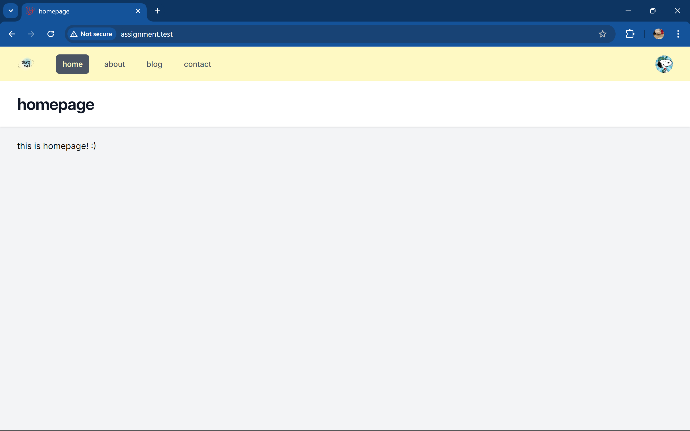
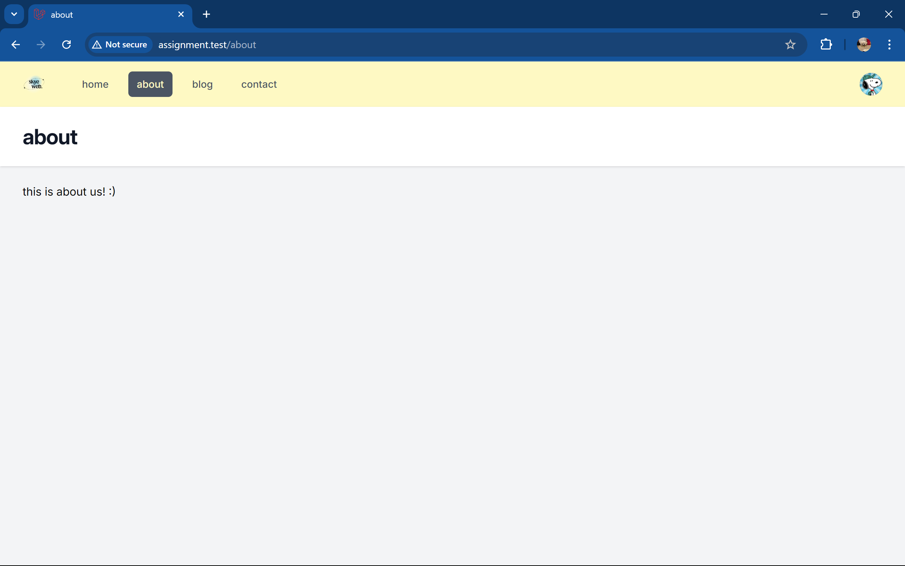
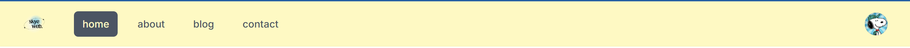
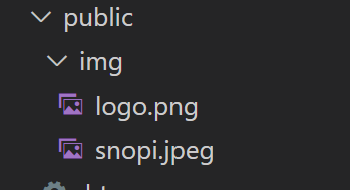
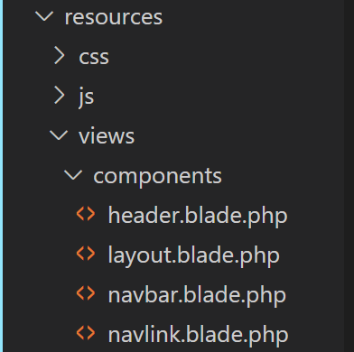
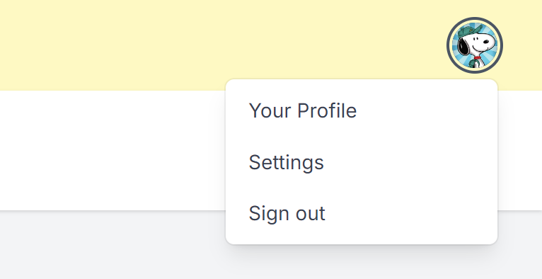
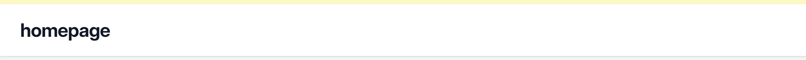
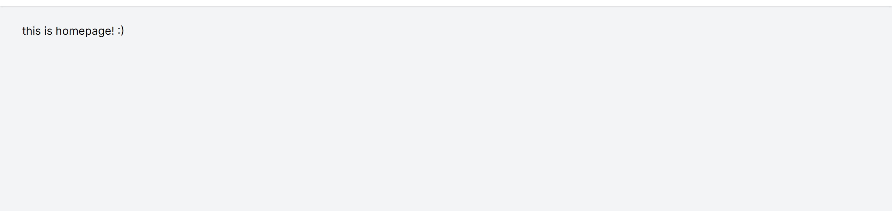

<div align=center>

# Framework Base Programming <br> Laravel Assignment
Fayza Aqila Bachtiar - 5025221087

</div>

### Overview
The assignment requires us to work on a website programmed using laravel framework and a development environment. For this assignment, I choose to use `laravel herd` as my development environment.

## Week 1
In this first week, our objectives are:

- installing the development environment
- directories structure (getting familiar with the framework's structure)
- using blade and their components

From the tutorial video(s) that we are given, there are 4 main webpages: `homepage`, `about`, `blog`, and `contact`.  As a 'report' form of the assignment, these are the four UI pages from my website:





The main attractives from this page is all basically a free `css tailwind` template all straight from the tutorial. There are no big difference (yet) from all pages. To narrow explanation, it will be best by describing the main 3 parts of the web.

### navigation bar (navbar)

The navbar contains 6 objectives: a logo, 4 navigation links (to other pages) and a profile. In my navbar, I made small changes beside the video, that is changing the navbar's color (previously `bg-gray-800` to now a cheerful `bg-yellow-100`), then adding my own logo and profile image.



in adding those local images, is to first make a `img` directory in the `public` directory. Then calling them as dir paths in the code `src="img/logo.png"` and `src="img/snopi.jpeg"`. 

When using the laravel framework, there are these 'shortcuts' to make programming the website easier, that is by making the codes as 'templates'.

For example, visualize each webpage as a 'usual' `blade` code, where there are seperately 4 blades and later on 4 different contents in 4 different pages. However, for all 'template' views in all pages, we utilize the blade files that became `components` using the command `php artisan make:component <component_name>`. 



The navbar uses 2 components: [navbar.blade.php](/resources/views/components/navbar.blade.php) and [navlink.blade.php](/resources/views/components/navlink.blade.php) both located in `resources/views/components` dir. 
- The `navlink` component is to help navigate the user of which active page they are on. Like for instance, if they are in the homepage, then the homepage section shall in be colored as grey in the navbar, whereas the other sections are just plain yellow background. 
- the `navbar` component itself had the original tailwind code of the navbar with the `navlink` component called using `<x-navlink>`: 
    ```html
    <div class="ml-10 flex items-baseline space-x-4">
        <x-navlink href="/" :active="request() -> is('/')">home</x-navlink>
        <x-navlink href="/about" :active="request() -> is('about')">about</x-navlink>
        <x-navlink href="/blog" :active="request() -> is('blog')">blog</x-navlink>
        <x-navlink href="/contact" :active="request() -> is('contact')">contact</x-navlink>
    </div> 
    ```

Then there is another 'unactive' feature in the navbar. That is when we click on the `profile` picture, there shall be a small pop up of `your profile`, `settings` and `sign out`. Which codes are also a part of the tailwind original code.

```html
<div x-show="isOpen"
    x-transition:enter="transition ease-out duration-100 transform"
    x-transition:enter-start="opacity-0 scale-95"
    x-transition:enter-end="opacity-100 scale-100"
    x-transition:leave="transition ease-in duration-75 transform"
    x-transition:leave-start="opacity-100 scale-100"
    x-transition:leave-end="opacity-0 scale-95"
    class="absolute right-0 z-10 mt-2 w-48 origin-top-right rounded-md bg-white py-1 shadow-lg ring-1
    ring-black ring-opacity-5 focus:outline-none" role="menu" aria-orientation="vertical" 
    aria-labelledby="user-menu-button" tabindex="-1">
    <!-- Active: "bg-gray-100", Not Active: "" -->
    <a href="#" class="block px-4 py-2 text-sm text-gray-700" role="menuitem" tabindex="-1" id="user-menu-item-0">Your Profile</a>
    <a href="#" class="block px-4 py-2 text-sm text-gray-700" role="menuitem" tabindex="-1" id="user-menu-item-1">Settings</a>
    <a href="#" class="block px-4 py-2 text-sm text-gray-700" role="menuitem" tabindex="-1" id="user-menu-item-2">Sign out</a>
</div>
```

and last from the navbar is the `mobile` version. Where the website was made responsive from the tailwind template. So when the web window was minimized, it shows a simple responsive view.
.png>)
when minimized, the navbar only contains the logo and a simple three line icon on the upper left. When the icon is clicked, it will preview the previous navigation menus and profile menus. 

### header

Quite different from the navbar, the header had a lot simple code structure, with only one blade component [header.blade.php](/resources/views/components/header.blade.php). However, to determine each text shown in each page, is to first add an `associative array` in the [web.php](/routes/web.php), just beside the page that connnect each web page.

```php
Route::get('/', function () {
    return view('home', ['title' => 'homepage']);
});

Route::get('/about', function () {
    return view('about', ['title' => 'about']);
});

Route::get('/blog', function () {
    return view('blog', ['title' => 'blog']);
});

Route::get('/contact', function () {
    return view('contact', ['title' => 'contact']);
});
```
the `title` stated each page where later will be shown in the header. But instead of putting it in the exact header component file, we will call it later in the [home.blade.php](/resources/views/home.blade.php). So it will appear as this:

- `header.blade.php`
    ```html
    <header class="bg-white shadow">
        <div class="mx-auto max-w-7xl px-4 py-6 sm:px-6 lg:px-8">
            <h1 class="text-3xl font-bold tracking-tight text-gray-900">{{ $slot }}</h1>
        </div>
    </header>
    ```
- `home.blade.php`
    ```html
    <x-slot:title>{{ $title }}</x-slot:title>
    ```

Since the associative array in the route is connected to each web page blade, it is not possible to directly call them from the header component. So, within the header component, it will still be filled with the `slot` variable, then later on in the home blade we use `x-slot:title` and call the `title` variable in it. From there all three files are connected.

### page content

Before filling in content, there is a need to explain one more component, the [layout.blade.php](/resources/views/components/layout.blade.php). Since every html file had a certain structure, so instead of repeating it all the time, the `layout` component came in handy. Within the component, is the basic html code, from `doctype` to the end `</html>` and in the `<body> </body>` is where the navbar and header component is called using `<x-navbar>` and `<x-header>` and in the `<main>`, is a usual layouting code and a `$slot` variable for the real page content later filled in each page blades, using `<x-layout>`.

- `layout.blade.php`
    ```html
    <body class="h-full">
        <div class="min-h-full">
            <x-navbar></x-navbar>
    
            <x-header>{{ $title }}</x-header>

            <main>
                <div class="mx-auto max-w-7xl px-4 py-6 sm:px-6 lg:px-8">
                    {{ $slot }}
                </div>
            </main>
        </div>  
    </body>
    ```
- `home.blade.php` - for example
    ```html
    <x-layout>
        <x-slot:title>{{ $title }}</x-slot:title>

        <h3>this is homepage! :)</h3>
    </x-layout>
    ```

Those are all necessary UI changes made from the first-four tutorial videos in the first week. Thank you >.<